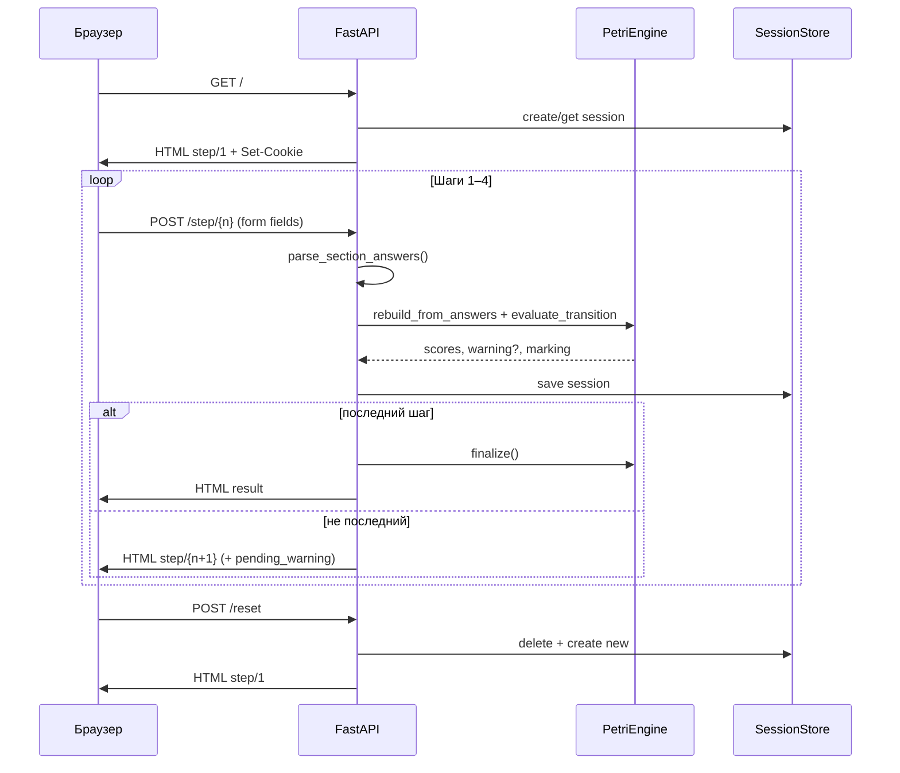

# Дифференциальная диагностика лимфомы Ходжкина

Веб-приложение для дифференциальной диагностики **нодулярного** и **смешанно-клеточного** склероза на основе программной интерпретации сети Петри. Вся логика весов и переходов задаётся в `app/petri/hodgkin_net.json` — в коде нет разветвлённого if-else по симптомам.

---

## 1. Структура проекта

### Архитектура

Монолитное **full-stack** приложение: бэкенд и фронтенд в одном процессе FastAPI.

| Слой | Технологии | Назначение |
|------|------------|------------|
| **Бэкенд** | Python 3.11+, FastAPI, Uvicorn | HTTP-маршруты, сессии, оркестрация опроса |
| **Движок** | `app/petri/` | Загрузка сети Петри, маркировка, переходы, финализация |
| **Фронтенд** | Jinja2, HTML, CSS, vanilla JS | Многошаговый опросник (4 шага + результат) |
| **Хранение** | In-memory `SessionStore` + cookie | Состояние опроса по `session_id` (TTL 24 ч) |
| **Логирование** | structlog | `logs/hodgkin.log` (ротация 10 MB × 5) |

### Дерево каталогов

```
1/
├── app/
│   ├── main.py                 # FastAPI, middleware, статика
│   ├── config.py               # пути, логи, сессии
│   ├── api/routes.py           # HTTP-маршруты (HTML)
│   ├── petri/
│   │   ├── hodgkin_net.json    # сеть Петри (единственный источник весов)
│   │   ├── model.py            # загрузка JSON → PetriNet
│   │   ├── net.py              # Place, Arc, Transition, Marking
│   │   └── engine.py           # PetriEngine: mark, transition, finalize
│   ├── services/
│   │   ├── diagnosis.py        # parse answers → engine → result
│   │   └── session_store.py    # in-memory сессии
│   ├── web/
│   │   ├── templates/          # step.html, result.html, base.html
│   │   └── static/             # app.js, style.css
│   └── logging/setup.py
├── tests/                      # pytest: engine, сценарии, HTTP smoke
├── scripts/
│   ├── run.sh                  # локальный запуск
│   └── smoke.sh                # быстрая проверка
├── logs/                       # создаётся при работе
├── requirements.txt
├── Dockerfile
└── docker-compose.yml
```

### Основные зависимости

| Пакет | Версия | Роль |
|-------|--------|------|
| `fastapi` | ≥0.110 | веб-фреймворк |
| `uvicorn[standard]` | ≥0.27 | ASGI-сервер |
| `jinja2` | ≥3.1 | шаблоны HTML |
| `python-multipart` | ≥0.0.9 | разбор HTML-форм |
| `structlog` | ≥24.1 | структурированные логи |
| `pytest`, `httpx` | dev | тесты |

### Выходные формы диагностики

| Форма | Позиция сети | Счётчик |
|-------|--------------|---------|
| Нодулярный склероз | b52 | `score_nodular` |
| Смешанно-клеточный вариант | b53 | `score_mixed` |

---

## 2. Запуск локально и развёртывание на сервере

### Минимальные требования

| Параметр | Локально | Сервер (prod) |
|----------|----------|---------------|
| CPU | 1 ядро | 1 vCPU |
| RAM | 256 MB | 512 MB |
| Диск | 200 MB | 1 GB (с логами) |
| ОС | Linux / macOS / WSL | Linux (рекомендуется) |
| Python | 3.11+ | 3.11+ (или Docker) |
| Сеть | порт 8000 свободен | 80/443 через reverse proxy |

### Переменные окружения

| Переменная | По умолчанию | Описание |
|------------|--------------|----------|
| `PORT` | `8000` | Порт Uvicorn / Docker |
| `HOST` | `127.0.0.1` | Хост (в `run.sh`; Docker слушает `0.0.0.0`) |
| `HODGKIN_SESSION_SECRET` | `hodgkin-dev-secret-change-in-production` | Секрет сессии (задать в prod) |

> База данных не используется. Сессии хранятся в памяти процесса — при рестарте контейнера незавершённые опросы теряются.

### Локальный запуск

```bash
cd 1
./scripts/run.sh
```

Откройте **http://127.0.0.1:8000/** (шаг 1: http://127.0.0.1:8000/step/1).

Другой порт:

```bash
PORT=8001 ./scripts/run.sh
```

Вручную:

```bash
python3 -m venv .venv
source .venv/bin/activate
pip install -r requirements.txt
uvicorn app.main:app --reload --host 127.0.0.1 --port 8000
```

> Ошибка **-102** в браузере = сервер не запущен (connection refused).

### Docker

```bash
cd 1
docker compose up -d --build
```

Другой порт: `PORT=8001 docker compose up -d --build`.

### Развёртывание на сервере

1. Установить Docker **или** Python 3.11+.
2. Склонировать репозиторий, перейти в `1/`.
3. Задать prod-секрет: `export HODGKIN_SESSION_SECRET=$(openssl rand -hex 32)`.
4. Запустить: `docker compose up -d --build`.
5. Поставить reverse proxy (nginx/Caddy) с TLS на `127.0.0.1:8000`.
6. Смонтировать `./logs` для сохранения логов между перезапусками.

Пример фрагмента nginx:

```nginx
location / {
    proxy_pass http://127.0.0.1:8000;
    proxy_set_header Host $host;
    proxy_set_header X-Real-IP $remote_addr;
}
```

### Тесты и смоук

```bash
pytest tests/ -v
# или
./scripts/smoke.sh
```

Smoke-тест проверяет полный проход опросника: все GET/POST маршруты возвращают **200**.

### Мониторинг

`GET /api/health` → JSON:

```json
{
  "status": "ok",
  "disease": "Лимфома Ходжкина",
  "sections": 4,
  "places": 51
}
```

---

## 3. Схема взаимодействия клиент — сервер

Приложение использует **HTML-формы** (не REST JSON API). Сессия передаётся через cookie `hodgkin_session`.

### Диаграмма потока



### HTTP-маршруты

| Метод | Путь | Назначение | Ответ |
|-------|------|------------|-------|
| GET | `/` | Старт опроса | HTML шаг 1, cookie сессии |
| GET | `/step/{n}` | Форма раздела n (1–4) | HTML с чекбоксами/radio |
| POST | `/step/{n}` | Отправка ответов раздела | HTML следующий шаг или результат |
| GET | `/result` | Повторный просмотр итога | HTML результат |
| POST | `/reset` | Новый опрос | HTML шаг 1, новая сессия |
| GET | `/api/health` | Healthcheck | JSON |
| GET | `/static/*` | CSS, JS | статические файлы |

### Формат входных данных (POST `/step/{n}`)

Тело: `application/x-www-form-urlencoded`.

| Тип поля | Имя в форме | Значения | Пример |
|----------|-------------|----------|--------|
| Чекбокс (boolean) | `{place_id}` | `"on"` если отмечен | `b1=on` |
| Порог да/нет | `{place_id}` | `"yes"` / отсутствует | `b4=yes` |
| Взаимоисключающая группа | `group_{group_name}` | id выбранного place | `group_sex=b19` |

**Разделы и признаки:**

| Шаг | Раздел | ID признаков |
|-----|--------|--------------|
| 1 | Жалобы | b1–b8 |
| 2 | Осмотр | b13–b25 (пол b19/b20 — radio) |
| 3 | Лаборатория | b28–b41 |
| 4 | Инструментальные | b44–b51 |

### Формат ответа

**HTML-страницы** (не JSON). Контекст шаблона `step.html`:

```json
{
  "step": 2,
  "total_steps": 4,
  "section": { "id": "examination", "title": "Осмотр врача", "order": 2 },
  "places": [
    { "id": "b13", "label": "...", "input_type": "boolean", "checked": false }
  ],
  "exclusive_groups": {
    "sex": [
      { "id": "b19", "label": "Мужчина", "checked": false, "group_unspecified": true },
      { "id": "b20", "label": "Женщина", "checked": false, "group_unspecified": true }
    ]
  },
  "pending_warning": "Не выявлено подозрений..."
}
```

**Страница результата** (`result.html`):

```json
{
  "result": {
    "score_nodular": 12.0,
    "score_mixed": 5.0,
    "winner": "nodular",
    "winner_label": "Нодулярный склероз",
    "tie": false,
    "instrumental_transition_fired": true,
    "contributions": [
      { "place_id": "b1", "label": "...", "score_nodular": 2, "score_mixed": 0 }
    ]
  },
  "forms": {
    "nodular": { "label": "Нодулярный склероз", "place_id": "b52" },
    "mixed": { "label": "Смешанно-клеточный вариант", "place_id": "b53" }
  },
  "warnings": ["Не выявлено подозрений..."]
}
```

### Состояние сессии (сервер)

```json
{
  "session_id": "uuid",
  "answers": { "b1": true, "b4": false },
  "marking_snapshot": {
    "places": { "b9": 1 },
    "scores": { "score_nodular": 3.0, "score_mixed": 0.0 }
  },
  "current_step": 2,
  "completed_sections": ["complaints"],
  "warnings": [],
  "pending_warning": null
}
```

---

## 4. Алгоритм расчёта на бэкенде

Единственный источник правды — `app/petri/hodgkin_net.json`. Код в `app/petri/engine.py` только интерпретирует JSON.

### Общая схема

```
Входные данные (POST форма)
    ↓
Шаг 1: parse_section_answers() — place_id → bool
    ↓
Шаг 2: merge в session.answers
    ↓
Шаг 3: rebuild_from_answers() — полный пересчёт маркировки
    ↓
Шаг 4: для каждого отмеченного place — _mark_place()
         → token в marking.places[place_id] = 1
         → по исходящим дугам: scores[target] += weight
    ↓
Шаг 5: evaluate_section_transition(section_id)
         → проверка guard перехода
         → установка токенов в промежуточных местах (b9, b10, …)
         → warning если переход не сработал
    ↓
Шаг 6 (последний раздел): finalize()
         → argmax(score_nodular, score_mixed)
         → explain() — вклад каждого признака
    ↓
Выходные данные (HTML результат)
```

### Шаг 3–4: Применение весовых коэффициентов

Для каждого отмеченного признака `place_id` из JSON читаются исходящие **дуги** (`arcs`):

```json
"b4": {
  "arcs": [
    { "target": "score_nodular", "weight": 1 },
    { "target": "score_mixed", "weight": 2 }
  ]
}
```

При отметке b4: `score_nodular += 1`, `score_mixed += 2`.

**Типы признаков:**

| `input_type` | Поведение |
|--------------|-----------|
| `boolean` | отмечен / не отмечен |
| `threshold_yes_no` | «показатель превышает порог: да/нет» |
| `exclusive_choice` | radio-группа (пол, возраст) — только один активен |

### Шаг 5: Маркировка сети Петri и переходы

**Маркировка** (`Marking`):

- `places` — токены в позициях (отмеченные признаки + промежуточные b9/b10/…)
- `scores` — накопленные баллы `score_nodular`, `score_mixed`

**Переходы между разделами** (этапы 1–3): условие `aggregate_condition: sum_weights_gt_zero`

- Суммируются веса отмеченных признаков **текущего раздела** по каждой ветке.
- Если сумма ветки > 0 (или ≥ `min_branch_weights` при наличии) → токен в промежуточное место:
  - жалобы → b9 (nodular) / b10 (mixed)
  - осмотр → b11 / b12 (mixed требует ≥6 баллов в разделе)
  - лаборатория → b26 / b27 (nodular ≥4, mixed ≥9)
- Если ни одна ветка не сработала → `warning_message`, переход **не блокируется**.

**Переход инструментальных → финал** (этап 4): `fire_condition: any_one_marked`

- Достаточно ≥1 отмеченного из b44–b51.
- При срабатывании → токены в b42/b43.
- Пустой инструментальный блок → финал всё равно показывается (`empty_instrumental_still_finalize: true`).

### Шаг 6: Финализация

```
score_n = marking.scores["score_nodular"]
score_m = marking.scores["score_mixed"]

if score_n == score_m:
    winner = null
    winner_label = "Формы равновероятны по баллам" (если score > 0)
elif score_n > score_m:
    winner = "nodular"  → b52
else:
    winner = "mixed"    → b53
```

Минимального порога диагноза **нет** — результат 0/0 допустим.

### Пример расчёта (JSON)

**Вход:** пользователь отметил b1 и b4 на шаге «Жалобы».

```json
{
  "section": "complaints",
  "answers": { "b1": true, "b4": true }
}
```

**После rebuild_from_answers:**

```json
{
  "marking": {
    "places": { "b1": 1, "b4": 1 },
    "scores": { "score_nodular": 3.0, "score_mixed": 2.0 }
  }
}
```

*(b1: +2 nodular; b4: +1 nodular, +2 mixed)*

**После evaluate_section_transition("complaints"):**

```json
{
  "transition": {
    "id": "t_complaints_to_exam",
    "fired": true,
    "nodular_fired": true,
    "mixed_fired": true
  },
  "marking": {
    "places": { "b1": 1, "b4": 1, "b9": 1, "b10": 1 },
    "scores": { "score_nodular": 3.0, "score_mixed": 2.0 }
  },
  "warning": null
}
```

**После прохождения всех разделов — finalize():**

```json
{
  "score_nodular": 15.0,
  "score_mixed": 8.0,
  "winner": "nodular",
  "winner_label": "Нодулярный склероз",
  "tie": false,
  "instrumental_transition_fired": true,
  "contributions": [
    { "place_id": "b1", "label": "Ощущение припухлости...", "score_nodular": 2, "score_mixed": 0 },
    { "place_id": "b44", "label": "...", "score_nodular": 3, "score_mixed": 0 }
  ]
}
```

### Поток опроса (UI)

1. **Жалобы** (b1–b8) → b9/b10
2. **Осмотр** (b13–b25) → b11/b12
3. **Лаборатория** (b28–b41) → b26/b27
4. **Инструментальные** (b44–b51) → b42/b43 → **b52/b53**

На переходах между разделами при отсутствии весов показывается предупреждение (без блокировки).
