# Дифференциальная диагностика ХАТ (болезнь Хашимото)

Веб-приложение для дифференциальной диагностики хронического аутоиммунного тиреоидита (**гипертрофическая** и **атрофическая** формы) на основе программной интерпретации сети Петри. Вся логика весов и переходов задаётся в `app/petri/hashimoto_net.json`.

---

## 1. Структура проекта

### Архитектура

Монолитное **full-stack** приложение: бэкенд и фронтенд в одном процессе FastAPI.

| Слой | Технологии | Назначение |
|------|------------|------------|
| **Бэкенд** | Python 3.11+, FastAPI, Uvicorn | HTTP-маршруты, сессии, оркестрация опроса |
| **Движок** | `app/petri/` | Загрузка сети Петри, маркировка, переходы, финализация |
| **Фронтенд** | Jinja2, HTML, CSS, vanilla JS | Многошаговый опросник (4 шага + результат) |
| **Хранение** | In-memory `SessionStore` + cookie | Состояние опроса по `session_id` (TTL 24 ч) |
| **Логирование** | structlog | `logs/hashimoto.log`, `logs/hashimoto_audit.jsonl` |

### Дерево каталогов

```
2/
├── app/
│   ├── main.py                 # FastAPI, middleware, обработка ошибок
│   ├── config.py               # пути, логи, сессии
│   ├── api/routes.py           # HTTP-маршруты (HTML)
│   ├── petri/
│   │   ├── hashimoto_net.json  # сеть Петри (единственный источник весов)
│   │   ├── model.py            # загрузка JSON → PetriNet
│   │   ├── net.py              # Place, Arc, Transition, Marking
│   │   └── engine.py           # PetriEngine: mark, transition, finalize
│   ├── services/
│   │   ├── diagnosis.py        # parse answers → engine → result
│   │   └── session_store.py    # in-memory сессии
│   ├── web/
│   │   ├── templates/          # step.html, result.html, base.html
│   │   └── static/             # app.js, style.css
│   └── logging/setup.py        # текстовый лог + audit JSONL
├── tests/                      # pytest: engine, сценарии, HTTP smoke (31 тест)
├── scripts/
│   ├── run.sh                  # локальный запуск
│   └── smoke.sh                # быстрая проверка
├── logs/                       # создаётся при работе
├── requirements.txt
├── Dockerfile
└── docker-compose.yml
```

### Основные зависимости

| Пакет | Версия | Роль |
|-------|--------|------|
| `fastapi` | ≥0.110 | веб-фреймворк |
| `uvicorn[standard]` | ≥0.27 | ASGI-сервер |
| `jinja2` | ≥3.1 | шаблоны HTML |
| `python-multipart` | ≥0.0.9 | разбор HTML-форм |
| `structlog` | ≥24.1 | структурированные логи |
| `pytest`, `httpx` | dev | тесты |

### Выходные формы диагностики

| Форма | Позиция сети | Счётчик |
|-------|--------------|---------|
| Гипертрофическая форма ХАТ | b41 | `score_hyper` |
| Атрофическая форма ХАТ | b42 | `score_atrophic` |

---

## 2. Запуск локально и развёртывание на сервере

### Минимальные требования

| Параметр | Локально | Сервер (prod) |
|----------|----------|---------------|
| CPU | 1 ядро | 1 vCPU |
| RAM | 256 MB | 512 MB |
| Диск | 200 MB | 1 GB (с логами) |
| ОС | Linux / macOS / WSL | Linux (рекомендуется) |
| Python | 3.11+ | 3.11+ (или Docker) |
| Сеть | порт 8000 свободен | 80/443 через reverse proxy |

> При одновременной разработке обоих проектов из корня репозитория используйте разные порты: `cd 1 && PORT=8000 ./scripts/run.sh` и `cd 2 && PORT=8001 ./scripts/run.sh`.

### Переменные окружения

| Переменная | По умолчанию | Описание |
|------------|--------------|----------|
| `PORT` | `8000` | Порт Uvicorn / Docker |
| `HOST` | `127.0.0.1` | Хост (в `run.sh`; Docker слушает `0.0.0.0`) |

> Секрет сессии задан в `app/config.py` (`SESSION_SECRET_KEY`). Для prod рекомендуется вынести в переменную окружения и изменить значение по умолчанию.

> База данных не используется. Сессии хранятся в памяти процесса.

### Локальный запуск

```bash
cd 2
./scripts/run.sh
```

Откройте **http://127.0.0.1:8000/**

Вручную:

```bash
python3 -m venv .venv
source .venv/bin/activate   # Windows: .venv\Scripts\activate
pip install -r requirements.txt
uvicorn app.main:app --reload --host 127.0.0.1 --port 8000
```

### Docker

```bash
cd 2
docker compose up -d --build
```

Другой порт: `PORT=8001 docker compose up -d --build`.

### Развёртывание на сервере

1. Установить Docker **или** Python 3.11+.
2. Склонировать репозиторий, перейти в `2/`.
3. Изменить `SESSION_SECRET_KEY` в конфиге или задать через env (после доработки).
4. Запустить: `docker compose up -d --build`.
5. Поставить reverse proxy (nginx/Caddy) с TLS.
6. Смонтировать `./logs` для audit-логов.

Пример фрагмента nginx:

```nginx
location / {
    proxy_pass http://127.0.0.1:8000;
    proxy_set_header Host $host;
    proxy_set_header X-Real-IP $remote_addr;
}
```

### Тесты

```bash
pytest tests/ -v          # unit + сценарии + HTTP smoke (31 тест)
./scripts/smoke.sh
```

Smoke-тест проверяет, что все GET/POST маршруты опросника отвечают **200**.

### Мониторинг

`GET /health` → JSON:

```json
{
  "status": "ok",
  "service": "hashimoto-diagnosis"
}
```

---

## 3. Схема взаимодействия клиент — сервер

Приложение использует **HTML-формы** (не REST JSON API). Сессия передаётся через cookie `hashimoto_session`.

### Диаграмма потока

```mermaid
sequenceDiagram
    participant B as Браузер
    participant S as FastAPI
    participant E as PetriEngine
    participant M as SessionStore

    B->>S: GET /
    S->>M: create/get session
    S->>B: HTML step/1 + Set-Cookie

    loop Шаги 1–4
        B->>S: POST /step/{n} (form fields)
        S->>S: parse_section_answers()
        S->>E: apply_section()
        E-->>S: scores, warning?, marking
        S->>M: save session + audit_log
        alt последний шаг
            S->>E: finalize()
            S->>B: HTML result
        else не последний
            S->>B: HTML step/{n+1} (+ pending_warning)
        end
    end

    B->>S: POST /reset
    S->>M: delete + create new
    S->>B: HTML step/1
```



### HTTP-маршруты

| Метод | Путь | Назначение | Ответ |
|-------|------|------------|-------|
| GET | `/` | Старт опроса | HTML шаг 1, cookie сессии |
| GET | `/step/{n}` | Форма раздела n (1–4) | HTML с чекбоксами/radio |
| POST | `/step/{n}` | Отправка ответов раздела | HTML следующий шаг или результат |
| GET | `/result` | Повторный просмотр итога | HTML результат |
| POST | `/reset` | Новый опрос | HTML шаг 1, новая сессия |
| GET | `/health` | Healthcheck | JSON |
| GET | `/static/*` | CSS, JS | статические файлы |

### Формат входных данных (POST `/step/{n}`)

Тело: `application/x-www-form-urlencoded`.

| Тип поля | Имя в форме | Значения | Пример |
|----------|-------------|----------|--------|
| Чекбокс (boolean) | `{place_id}` | `"on"` если отмечен | `b1=on` |
| Порог да/нет | `{place_id}` | `"yes"` / отсутствует | `b23=yes` |
| Взаимоисключающая группа | `group_{group_name}` | id выбранного place | `group_sex=b16` |

**Разделы и признаки:**

| Шаг | Раздел | ID признаков |
|-----|--------|--------------|
| 1 | Жалобы | b1–b9 |
| 2 | Осмотр | b14–b20 (пол b16/b17 — radio; возраст b18/b19) |
| 3 | Лаборатория | b23–b34 (две ветки: hyper / atrophic) |
| 4 | Инструментальные | b37–b40 |

### Формат ответа

**HTML-страницы** (не JSON). Контекст шаблона `step.html` для лаборатории включает две группы:

```json
{
  "step": 3,
  "total_steps": 4,
  "section": { "id": "laboratory", "title": "Лабораторные исследования", "order": 3 },
  "lab_groups": {
    "hyper": {
      "title": "Гипертрофическая ветка (лаборатория)",
      "places": [{ "id": "b23", "label": "ТТГ 4,5–15...", "input_type": "threshold_yes_no", "checked": false }]
    },
    "atrophic": {
      "title": "Атрофическая ветка (лаборатория)",
      "places": [{ "id": "b29", "label": "ТТГ >20...", "input_type": "threshold_yes_no", "checked": false }]
    }
  },
  "pending_warning": null
}
```

**Страница результата** (`result.html`):

```json
{
  "result": {
    "score_hyper": 12.0,
    "score_atrophic": 5.0,
    "winner": "hyper",
    "winner_label": "Гипертрофическая форма ХАТ",
    "tie": false,
    "contributions": [
      { "place_id": "b1", "label": "Ощущение «кома» в шее", "score_hyper": 2, "score_atrophic": 0 }
    ]
  },
  "forms": {
    "hyper": { "label": "Гипертрофическая форма ХАТ", "place_id": "b41" },
    "atrophic": { "label": "Атрофическая форма ХАТ", "place_id": "b42" }
  },
  "warnings": []
}
```

### Audit-лог (сервер, JSONL)

После каждого POST `/step/{n}` в `logs/hashimoto_audit.jsonl`:

```json
{
  "ts": "2026-05-15T15:00:00Z",
  "event": "section_submitted",
  "session_id": "abc123",
  "section": "complaints",
  "marked_places": ["b1", "b4"],
  "scores_after": { "score_hyper": 3.0, "score_atrophic": 1.0 },
  "transition": { "id": "t_complaints_to_exam", "fired": true },
  "warning_shown": null
}
```

### Состояние сессии (сервер)

```json
{
  "answers": { "b1": true, "b4": true },
  "marking": {
    "places": { "b10": 1, "b11": 1 },
    "scores": { "score_hyper": 3.0, "score_atrophic": 1.0 }
  },
  "step": 2,
  "completed_sections": ["complaints"],
  "warnings_shown": [],
  "pending_warning": null
}
```

---

## 4. Алгоритм расчёта на бэкенде

Единственный источник правды — `app/petri/hashimoto_net.json`. Код в `app/petri/engine.py` только интерпретирует JSON.

### Общая схема

```
Входные данные (POST форма)
    ↓
Шаг 1: parse_section_answers() — place_id → bool
    ↓
Шаг 2: apply_section(section_id, section_answers)
         → merge ответов текущего раздела
         → _normalize_exclusive_groups() (пол, возраст)
    ↓
Шаг 3: recompute_from_answers() — полный пересчёт (идемпотентность)
    ↓
Шаг 4: для каждого отмеченного place — _apply_place_mark()
         → token в marking.places[place_id] = 1
         → по исходящим дугам: scores[target] += weight
    ↓
Шаг 5: evaluate_transition_for_section(section_id)
         → проверка guard перехода
         → токены в промежуточных местах (b10, b11, …)
         → warning если переход не сработал
    ↓
Шаг 6 (финал): finalize()
         → argmax(score_hyper, score_atrophic)
         → explain_hyper / explain_atrophic
    ↓
Выходные данные (HTML результат)
```

### Шаг 4: Применение весовых коэффициентов

Для каждого отмеченного признака из JSON читаются исходящие **дуги** (`arcs`):

```json
"b5": {
  "arcs": [
    { "target": "score_hyper", "weight": 1 },
    { "target": "score_atrophic", "weight": 2 }
  ]
}
```

При отметке b5: `score_hyper += 1`, `score_atrophic += 2`.

**Обозначения весов в модели:**

| Запись в таблице | Смысл в коде |
|------------------|--------------|
| `(N)` в колонке гипертрофический | +N к `score_hyper` |
| `(N)` в колонке атрофический | +N к `score_atrophic` |
| `(1) / (2)` | +1 hyper, +2 atrophic при одной отметке |
| Пустая колонка | признак только для одной формы |

**Типы признаков:**

| `input_type` | Поведение |
|--------------|-----------|
| `boolean` | отмечен / не отмечен |
| `threshold_yes_no` | «показатель превышает порог: да/нет» |
| `exclusive_choice` | radio-группа (пол b16/b17, возраст b18/b19) |

### Шаг 5: Маркировка сети Петri и переходы

**Маркировка** (`Marking`):

- `places` — токены (отмеченные признаки + промежуточные b10/b11/…)
- `scores` — `score_hyper`, `score_atrophic`

**Переходы между разделами** (этапы 1–3): `aggregate_condition: sum_weights_gt_zero`

- Суммируются веса отмеченных признаков **текущего раздела** по каждой ветке.
- Если сумма ветки > 0 → токен в промежуточное место:
  - жалобы → b10 (hyper) / b11 (atrophic)
  - осмотр → b12 / b13
  - лаборатория → b21 / b22
- Если ни одна ветка не сработала → `warning_message`, переход **не блокируется**.

**Переход инструментальных → финал** (этап 4): `fire_condition: any_one_marked`

- Достаточно ≥1 отмеченного из b37–b40.
- При срабатывании → токены в b35/b36 и финальные b41/b42 (по ветке).
- Пустой инструментальный блок → финал всё равно показывается.

### Шаг 6: Условие выбора формы

```
hyper = marking.scores["score_hyper"]
atrophic = marking.scores["score_atrophic"]

if hyper == atrophic:
    winner = null, winner_label = null
elif hyper > atrophic:
    winner = "hyper"  → b41 «Гипертрофическая форма ХАТ»
else:
    winner = "atrophic" → b42 «Атрофическая форма ХАТ»
```

Минимального порога диагноза **нет** — результат 0/0 допустим, ошибки нет.

### Пример расчёта (JSON)

**Вход:** пользователь отметил b1 и b4 на шаге «Жалобы».

```json
{
  "section": "complaints",
  "answers": { "b1": true, "b4": true }
}
```

**После recompute_from_answers:**

```json
{
  "marking": {
    "places": { "b1": 1, "b4": 1 },
    "scores": { "score_hyper": 3.0, "score_atrophic": 1.0 }
  }
}
```

*(b1: +2 hyper; b4: +1 hyper, +1 atrophic)*

**После evaluate_transition_for_section("complaints"):**

```json
{
  "transition": {
    "id": "t_complaints_to_exam",
    "fired": true,
    "hyper_branch_fired": true,
    "atrophic_branch_fired": true
  },
  "marking": {
    "places": { "b1": 1, "b4": 1, "b10": 1, "b11": 1 },
    "scores": { "score_hyper": 3.0, "score_atrophic": 1.0 }
  },
  "warning": null
}
```

**После прохождения всех разделов — finalize():**

```json
{
  "scores": { "score_hyper": 12.0, "score_atrophic": 5.0 },
  "winner": "hyper",
  "winner_label": "Гипертрофическая форма ХАТ",
  "tie": false,
  "explain_hyper": [
    { "place_id": "b1", "label": "Ощущение «кома» в шее", "weight": 2 },
    { "place_id": "b14", "label": "Увеличение шеи в области ЩЖ", "weight": 2 }
  ],
  "explain_atrophic": [
    { "place_id": "b5", "label": "Сонливость", "weight": 2 }
  ]
}
```

### Поток опроса (UI)

1. **Жалобы** (b1–b9) → b10/b11
2. **Осмотр** (b14–b20) → b12/b13
3. **Лаборатория** (b23–b34, две ветки) → b21/b22
4. **Инструментальные** (b37–b40) → b35/b36 → **b41/b42**

На переходах при отсутствии весов показывается предупреждение (без блокировки). Для инструментального блока переход к b35/b36 срабатывает при ≥1 отмеченном признаке b37–b40.
